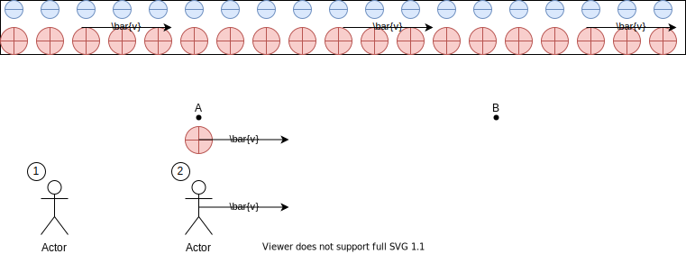

We start with Maxwell's Equations and the Principle of Relativity. From there, we derive, using only basic mathematics and some symmetry arguments, the most prominent phenomena or predictions of Special Relativity: length contraction and time dilation. We avoid the usage of Einstein's thought experiments involving the constancy of speed of light, but instead use a single thought experiment involving magnetic effects as the basis of the derivation.

### Contents

* Recap of principles of [Galilean Relativity](#galilean-relativity) 
* Explains the [failure](#failure-of-galilean-relativity) of Galilean Relativity when applied to electromagnetism
* [Correcting principles](#modifying-galilean-relativity-to-resolve-the-paradox) in Galilean Relativity to resolve the contradiction
* Derivation of the exact mathematical forms of [length contraction and time dilation](#mathematical-derivation-of-length-contraction-and-time-dilation)
* [Conclusion](#conclusion)

### Galilean Relativity

Several principles/assumptions underlie Galilean Relativity, the relativity that Newton adopted. These principles construct the relativity that we are all familiar with: when you throw a ball in a moving train, the velocity of the ball to the ground = velocity of ball to train + velocity of train. 

Because Galilean Relativity eventually fails, it's important to describe it in terms of principles so that we can figure exactly which principles are causing its failure and thus find a way to correct them.

#### Principle of Relativity

Principle of Relativity states that physics laws should be all the same in every inertial frame of reference. This implies that if we perform two same experiments in two different frames of references, the same result should be observed. 

#### Independence of space dimensions

Each space dimension $x,y,z$ are independent from one another. That is, their motion can be considered independently and don't interfere with each other. In particular, if two reference frames are moving relative to each other along the $x$ directions. Motions/experiments along the $y$ should be the same to the two, due to principle of relativity. This principle comes in handy in our derivation of special relativity later.

#### Symmetry of Reference Frame

If two frames of references are anti-symmetric, the results of their experiments should also be anti-symmetric. In particular, consider reference frames $A,B$ where $A,B$ are moving relative to each other. From $A$'s perspective, $B$ moves at velocity $v_B$. From $B$'s perspective, $A$ moves at $v_A$. This symmetric property dictates that $v_A=-v_B$. 

#### Absoluteness of Length

The length of an object measured from all reference frames is the same. To define the concept of length more precisely: a length is the spatial separation between 2 simultaneous events.

#### Absoluteness of Time

The time interval between any 2 events is the same measured from all frames of references.

#### Others

There are a few other symmetric properties which are _relatively_ intuitive to the mind and unimportant for our derivation. For example, performing an experiment in location A and location B (given their environment is the same) should yield the same result. Similarly, experiments at time A and time B should also yield the same result if the two times are basically indistinguishable.

#### Equation of Transformation

These principles can give rise to the equations of transformation of Galilean Relativity:
$$
x'=x+vt\\
t'=t
$$
Where $x',t'$ indicates the position and time in the primed coordinate. $v$ is the velocity of primed reference frame.

Everything works out harmoniously. Galilean Relativity is consistent under Newton's Laws (and thus all classical mechanics laws).

But things break down when Maxwell's Equations and Lorentz Force Law came along, which are experimentally tested to be valid.

#### Maxwell's Equations and Lorentz Force Law

$$
\iint_{\delta\sigma}\bold{E}\cdot \bold{dA}=\frac{Q_\sigma}{\epsilon_0}
\\
\iint_{\delta\sigma}\bold{B}\cdot \bold{dA}=0
\\
\int_{\delta\sigma} \bold{E}\cdot \bold{dl}=-\frac{\partial \bold{\Phi_B}}{\partial t}
\\
\int_{\delta\sigma} \bold{B}\cdot \bold{dl} = \mu_0 \bold{I} + \mu_0\epsilon_0 \frac{\partial \bold{\Phi_E}}{\partial t}
\\
\bold{F}=q(\bold{E}+\bold{v} \times\bold{B})
$$

Principle of Relativity governs that laws of electromagnetism should be invariant under transformation of coordinate system. For these laws to be invariant, we only need $\bold{E}+\bold{v}\times \bold{B}$ to be exert the same effect on charged particles in both frames of references. It doesn't need $E=E'$ or $B=B'$. In fact, $E+v\times B$ doesn't necessarily equate $E'+v'\times B'$. It's only required that the **effects** they produce are the same, which we will explore in greater detail later.

### Failure of Galilean Relativity

#### Thought Experiment Setup

We have 2 frames of references $S_1,S_2$. A positive charge $q$ moves $A\rightarrow B$ at velocity $v$. In the wire, the positive charges moves to the right with velocity $v$ while the negative charges are fixed. Reference frame $S_2$ also traverses right at velocity $v$. We denote the separation between each positive charge with $\Delta x^+$ and that of negative charges as $\Delta x^-$. Let $\rho^+,\rho^-$ denote the charge density of positive and negative charges. Then, $\rho=\frac{e}{\Delta x}$. $A,B,q$ are all $r$ away from the wire.

#### Contradiction

From perspective of $S_1$, $\Delta x^+_1=\Delta x^-_1$ since the wire cannot be charged. If it was charged, the charges would create a electrostatic force that pushes against the battery to make the charges space out. The current $S_1$ observes in the wire is $I_1=v\rho^+_1$. It generates a magnetic field at $A,B,q$. 

By Ampere's Law

$2\pi rB_1=\mu_0 I_1$

$B_1=\frac{\mu_0I_1}{2\pi r}=\frac{\mu_0v\rho^+_1}{2\pi r}$

The $E+v\times B$ quantity for $q$ is $vB_1 = \frac{\mu_0v^2\rho^+_1}{2\pi r}$

Now let's shift to the perspective of $S_2$. If we assume $\Delta x^+_2=\Delta x^-_2$, then $E_2=0$. It's easy to see that $B_2=B_1=\frac{\mu_0v\rho^-_2}{2\pi r}$. The $E+v\times B$ value from the perspective of $S_2$ is $0$!

Therefore something is wrong since the Principle of Relativity is broken: for $S_1$, $q$ accelerates towards the wire when it moves from $A\rightarrow B$. For $S_2$, $q$ doesn't accelerate towards the wire. According to the principle of relativity and the independence of space coordinates, $q$ should see its momentum increase by the same amount when it moves from $A\rightarrow B$ regardless of the reference frame in which we measure it.

### Modifying Galilean Relativity to resolve the paradox

The flaw occurs when we assume $\Delta x^+_2=\Delta x^-_2$.

In other words, we were wrong to assume that length is absolute. In other words, it must be that $\Delta x_2^+\ne \Delta x_1^+$ and $\Delta x_2^-\neq \Delta x_1^-$. Length of objects cannot be the same under all reference frames! In fact, given the knowledge that $q$ is attracted towards the wire in $S_1$, we know that $\rho^+_2<\rho^-_2$ and $\Delta x^+_2>\Delta x^-_2$. How is this possible? Does charges undergo motion (congregate together for negative charges and spacing out for positive charges) when we shift the frame of reference? Impossible. The only plausible explanation is that length contracted for the now moving negative charges and length expanded for the now stationary positive charges. 

Therefore, the first principle of Galilean Relativity that we must abandon is the [absoluteness of length](#absoluteness-of-length).

As we will see, for the math to workout correctly, we also need to abandon the [absoluteness of time](#absoluteness-of-time). You don't have to trust me. You can see it for yourself in our derivation.

### Mathematical Derivation of Length Contraction and Time Dilation

Therefore, the act of boosting from $S_1$ to $S_2$ changes the state of motion of positive charges from velocity $v$ to stationary, and changes the state of motion of negative charges from stationary to moving with velocity $v$. If this change of motion decrease $\Delta x^-$ to a factor of $\lambda$, it should symmetrically increase $\Delta x^+$ by a factor of $\frac{1}{\lambda}$. 

Thus, we can write $\Delta x^+_1=\Delta x^-_1=\Delta x_1$. 

And $\Delta x^+_2=\frac{\Delta x_1}{\lambda}$, $\Delta x^-_2=\lambda \Delta x_1$. 

We can also write $\rho^+_2=\frac{e}{\Delta x^+_2}=\frac{e\lambda}{\Delta x_1}$

Similarly $\rho^-_2=\frac{e}{\Delta x^-_2}=\frac{e}{\lambda\Delta x_1}$

By Gauss's Law, we can compute the electric field at $A,B,q$:

$2\pi r L E_2 = \frac{L \rho_2}{\epsilon_0}$

$E_2 = \frac{\rho_2}{2\pi r\epsilon_0}$

Here $\rho_2=\rho^-_2-\rho^+_2$ and the electric field points towards the wire. 

Now, as $q$ travels from $A\rightarrow B$, this $E_2$ accelerates $q$ towards the wire. It will change its momentum by 
$\Delta p_2=\Delta t_2 F_2=\Delta t_2 q E_2$
$=\frac{\rho_2 q \Delta t_2}{2\pi r\epsilon_0}$
$=\frac{(\rho^-_2 - \rho^+_2) q \Delta t_2}{2\pi r\epsilon_0}$

Now if we return to $S_1$, we can compute $\Delta p_1$.

$\Delta p_1=\Delta t_1 F_1 = \Delta t_1 q v\times B_1$
$=\frac{\mu_0qv^2\rho^+_1\Delta t_1}{2\pi r}$

Due to the Principle of Relativity and independence of spatial dimensions, our experiment along the y direction should yield the same result regardless of whether we are in $S_1$ or $S_2$.

Therefore, $\Delta p_1=\Delta p_2$

$\frac{(\rho^-_2 - \rho^+_2) q \Delta t_2}{2\pi r\epsilon_0}=\frac{\mu_0qv^2\rho^+_1\Delta t_1}{2\pi r}$

So,

$\frac{(\rho^-_2 - \rho^+_2)\Delta t_2}{\epsilon_0}=\mu_0v^2\rho^+_1\Delta t_1$

$(\rho^-_2 - \rho^+_2)\Delta t_2=\epsilon_0\mu_0v^2\rho^+_1\Delta t_1$

Plugging in $\rho^-_2,\rho^+_2$:

$(\frac{e}{\lambda \Delta x_1} - \frac{e\lambda}{\Delta x_1})\Delta t_2=\epsilon_0\mu_0v^2\frac{e}{\Delta x_1}\Delta t_1$

$(\frac{1}{\lambda} - \lambda)\Delta t_2=\epsilon_0\mu_0v^2 \Delta t_1$

Now, we recognize that $\epsilon_0\mu_0=\frac{1}{c^2}$

The equation becomes

$(\frac{1}{\lambda} - \lambda)\Delta t_2=\frac{v^2}{c^2} \Delta t_1$

Now we just need to relate $\Delta t_1, \Delta t_2, \lambda$.

That is simple because $\Delta t_1$ is just the amount of time it takes for $q$ to traverse $A\rightarrow B$ from $S_1$'s frame of reference. Therefore $\Delta t_1 = \frac{L_1}{v}$. Symmetrically, $\Delta t_2 = \frac{L_2}{v}$.

However, as we boost from $S_1$ to $S_2$, $A,B$ changes from stationary to moving with velocity $v$. Therefore, similar to the negative charges in the wire, $L$ should shrink to a factor of $\lambda$. Therefore $L_2=\lambda L_1$.

$\Delta t_2 = \frac{\lambda L_1}{v}= \lambda \Delta t_1$

Notice that $\Delta t_2<\Delta t_1$. So we say $\Delta t_1$ is dilated with respect to $\Delta t_2$.

Now let's substitute everything back to the original equation

$(\frac{1}{\lambda} - \lambda)\Delta t_2=\frac{v^2}{c^2} \Delta t_1$

It becomes

$(\frac{1}{\lambda} - \lambda)\lambda\Delta t_1=\frac{v^2}{c^2} \Delta t_1$

So,

$1- \lambda^2=\frac{v^2}{c^2}$

In other words,

$\lambda = \sqrt{1-\frac{v^2}{c^2}}$

### Conclusion

In a nutshell, throughout our efforts to resolve the paradox which breaks the Principle of Relativity, we assumed the correctness of Maxwell's Equations and Lorentz Force Law, which are well-tested. From these principles and symmetry arguments, we concluded that the only way to resolve to paradox is the forego the absoluteness of length and time across different reference frames. And then we computed exactly how length and time will change under a boost from $S_1$ to $S_2$. In this way, we have essentially derived the formula for length contraction and time dilation. 

##### Length Contraction

If an object, or more appropriately space itself, moves at velocity $v$ relative to $S$ and moves at velocity $0$ relative to $S'$, then $L_S = \sqrt{1-\frac{v^2}{c^2}}L_{S'}$. $L_{S'}$ can be called the proper length.

##### Time Dilation

In $S'$, let the space-distance separation between events $A,B$ to be $0$ and the time separation to be $\Delta t_{S'}$. For $S$ moving at velocity $v$ relative to $S'$, let its time separation of $A,B$ to be $\Delta t_S$, then $\Delta t_S=\frac{\Delta t_{S'}}{\sqrt{1-\frac{v^2}{c^2}}}$.

Given these two rather fundamental effects, we may further derive the full Lorentz Transformation like how Galilean Transformation maybe derived from its principles.

If we make speed of light the standard unit for speed (so $c=1$), full Lorentz Transformations are: 

$$
x'=\frac{x+vt}{\sqrt{1-v^2}}
$$

$$
t'=\frac{t+vx}{\sqrt{1-v^2}}
$$

We can see the hidden $\lambda=\sqrt{1-v^2}$ term clearly. 
