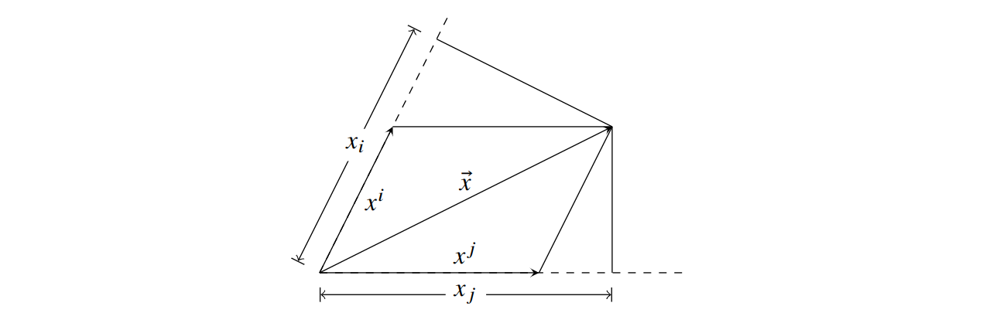

### Content

1. [What is a Vector, Covector, Tensor?](#vector-covector-tensor)
2. [Geodesic Equation Derivation](#geodesic-equation)

### Vector Covector Tensor

Let $\vec{x}$ be a vector. The coordinate system we use is represented by a set of basis vectors $\{\vec{e}_i\}$. 

**Definition.** The (contravariant) coordinate of $\vec{x}$ is defined to be $\{x^i\}$ such that $\vec{x}=\vec{e}_i x^i$. 

**Definition.** The covariant coordinate of $\vec{x}$ is defined to be $\{x_i\}$ such that $x_i = \vec{x} \cdot \vec{e}_i$.

Notice that in orthonormal coordinate, $x_i=x^i$: the dot product between a vector and a basis equals the vector's component in that basis. This is not true in arbitrary coordinate. The best way to illustrate the two's differences is using diagram below.

Based on the definition of contravariant and covariant coordinates, we can relate the two coordinate components,

$$
x_i = \vec{x}\cdot \vec{e}_i 
	= (x^j \vec{e}_j) \cdot \vec{e}_i 
	= x^j (\vec{e}_j \cdot \vec{e}_i) 
$$
	
**Definition.** We define $g_{ij} = \vec{e}_i \cdot \vec{e}_j$ to be the metric tensor of our coordinate system. 

Based on its definition, we can substitute $g_{ij}$ into our equation to get,

$$
	x_i = g_{ji} x^j
$$

This is called the **index lowering** operation.

If we have the covariant coordinates, how can we find the contravariant coordinates? We can do that by taking the matrix inverse of $g_{ji}$ on both sides of the equation, begetting,

$$
	g^{ki} x_i &= g^{ki}g_{ji} x^j &\text{$g^{ki}$ as an operator collapsing its 2nd index}\\
	g^{ki} x_i &= g^{ki}g_{ij} x^j &\text{symmetry of $g$ is used}\\
	g^{ki} x_i &= \delta^k_j x^j \\
	g^{ki} x_i &= x^k 
$$

This could be called a **index raising** operation, I suppose.

##### How do contravariant components transform?

When we change the coordinate system (i.e. $\{\vec{e}_i\}$), how do the contravariant components of a vector transform? The answer is intuitively straightforward---because the coordinate system is locally a non-orthonormal cartesian coordinate, we just need to follow the chain rule.

$$
	{x'}^i = \frac{\partial {x'}^i}{\partial x^j} x^j
$$

##### How do covariant components transform?

Remember that the covariant component $x_i$ is just $\vec{x}\cdot \vec{e}_i$. $\vec{x}$ is fixed. So, $x_i$ transforms like $\vec{e}_i$. To identify how the basis vectors transform is to find an expression for the primed basis vectors in terms of the unprimed basis vectors. 

Let's say we want to express $\vec{e}'_i$ in terms of the unprimed basis. $\frac{\partial x^j}{\partial {x'}^i}$ is intuitively the component of $\vec{e}'_i$ in the direction of $\vec{e}_j$. Thus,

$$
	\vec{e}'_i = \frac{\partial x^j}{\partial {x'}^i} \vec{e}_j
$$

Now we understand how coordinate basis transform, it's easy to find how the covariant vector transforms. 

$$
	x'_i = \vec{x}\cdot \vec{e}'_i = \vec{x}\cdot \left(\frac{\partial x^j}{\partial {x'}^i} \vec{e}_j \right) = \frac{\partial x^j}{\partial {x'}^i} \vec{x}\cdot \vec{e}_j = \frac{\partial x^j}{\partial {x'}^i} x_j
$$

As predicted, because the covariant vector component $x_i \propto \vec{e}_i$, $x_i$ varies in the same manner as the coordinate basis vector. 

##### Dual space, Dual vectors, Dual basis: reformalizing covariant and contravariant vectors

Notice that covectors (vectors represented using covariant coordinates) are hard to add. They don't add like normal vectors by separate summations along each dimension (refer to the diagram above if you don't see why). They don't exist in a normal vectorspace. Instead, they are a dual space. 

**Definition.** Given a vectorspace $V$, we denote the dual space of $V$ as $V^*$ and we define it as the set of linear maps from $V$ to scalars. 

The set of covariant coordinates of vectors can be considered as a dual space to those vectors' contravariant coordinates. We can view the dot product $x_1 x^1 + x_2 x^2 + \cdots + x_n x^n$ as a linear map where the $(x_1, x_2, \cdots, x_n)$ are the coefficients; in this sense, the coordinates $x_i$ is a dual vector. 

By consigning covariant coordinates to the role of linear maps or dual vectors, we are changing its geometric meaning. For example $x_i + y_i$ no longer mean a geometric addition of vectors. It's an addition of two linear maps. 

We have already seen that when given a set of basis $\{\vec{e}_i\}$, there are two ways to define the component of $\vec{x}$. The covariant definition: $x_i = \vec{x}\cdot \vec{e}_i$; and the contravariant definition. The contravariant coordinate definition we had provided is weak---it imposes constraints that the coordinate must satisfy without making it obvious that the coordinate exist in the first place. A stronger definition of the contravariant coordinate requires us to look into the dual space. 

**Definition.** Given a basis $\{\vec{e}_i\}$, its co-basis or dual basis is the set $\{\vec{e}^j\}$ such that $\vec{e}^j \cdot \vec{e}_i = \delta_i^j$.

In terms of these dual basis, the definition of covariant and contravariant coordinates are flipped.

The contravariant coordinates becomes like the covariant coordinates:

$$
	x^i \vec{e}_i &= \vec{x} \\
	x^i \vec{e}_i \cdot \vec{e}^i &= \vec{x}\cdot \vec{e}^i \\
	x^i &= \vec{x} \cdot \vec{e}^i
$$

We can also show the covariant coordinates becomes like the contravariant coordinates:
Let $\vec{x} = y_j \vec{e}^j$. We then prove $x_i = y_i$.

$$
	\vec{x} &= y_j \vec{e}^j \\
	\vec{x}\cdot \vec{e}_i &= y_j \vec{e}^j \cdot \vec{e}_i \\
	x_i &= y_j \delta^j_i \\
	x_i &= y_i 
$$

Now, we are able to define both contravariant coordinates and covariant coordinates more clearly. 

**Definition.** Given a basis $\{\vec{e}_i\}$ and its dual basis $\{\vec{e}^i\}$, we define $\vec{x}$'s covariant coordinates to be $x_i = \vec{x}\cdot \vec{e}_i$, we define $\vec{x}$'s contravariant coordinates to be $x^i = \vec{x}\cdot \vec{e}^i$. 

**Fact.** $\vec{x} = \vec{e}_i x^i = \vec{e}^i x_i$

Our new definitions of covariant and contravariant coordinates of a vector satisfy an important property: the $x_i$ component is only dependent upon the $\vec{e}^i$ basis. That is to say, if we know the $i^\text{th}$ basis vector and its dual basis vector, we can find the $i^\text{th}$ contravariant or covariant component of an arbitrary vector $\vec{x}$ without referring to any other basis vectors pointing in other directions. The intuition behind this property is establishing an essential independence between different dimensions or basis vectors. 

##### Abstracting to a rank-1 tensor

The definition of the components of a rank-1 tensor capitalizes on this independence between different dimensions. The rank-1 tensor is an abstract object. Like a vector, it has two types of components: covariant and contravariant. A tensor is an object with components and a "basis". However, in practice, it is the components with which we concern ourselves. 

Hence, for tensors, it's important for us to know how to compute the components from the basis and the abstract tensor object; finding the abstract object in terms of the component and the basis is much less useful.

The definition of a rank-1 tensor's components is essentially a generalization of the definition of the components of a vector---generalized in such a way that the independence between basis vectors still holds. 

**Definition.** Given a rank-1 tensor $\vec{x}$, its $i^\text{th}$ covariant component $x_i = T(\vec{e}_i)$, where $T$ is a linear map with respect to $\vec{e}_i$ ($T$ can depend on $\vec{x}$, which is just treated as a constant). 

In the case of a vector (special case of tensor), its covariant component $x_i = \vec{x}\cdot \vec{e}_i$, which is a linear map with respect to $\vec{e}_i$. 

**Definition.** Given a rank-1 tensor $\vec{x}$, its $i^\text{th}$ contravariant component $x^i = T(\vec{e}^i)$, where $T$ is a linear map with respect to $\vec{e}^i$ ($T$ can depend on $\vec{x}$, which is just treated as a constant). 

Again, for a vector, its contravariant component $x^i = \vec{x} \cdot \vec{e}^i$.

##### Higher rank tensors

The metric tensor $g$ is an example of a higher rank tensor. Studying $g$ will help us reach a definition of higher rank tensor that is physically useful. 

$g$'s covariant components are defined as 

$$
g_{ij} = \vec{e}_i \cdot \vec{e}_j
$$

It has a similar pattern of coordinate independence as a rank-1 tensor: the $ij^\text{th}$ covariant component is only dependent upon the $i^\text{th}$ and $j^\text{th}$ basis vectors. The dependence is also a linear map.

In fact, if we suggestively write 

$$
g_{ij} = T(\vec{e}_i, \vec{e}_j) \text{ and } T(\vec{e}_i, \vec{e}_j) = \vec{e}_i \cdot \vec{e}_j
$$

then the function $T$ is known as a bilinear map. It is a mapping that is linear with respect to both $\vec{e}_i$ and $\vec{e}_j$ separately. 

Thus, the natural way to extend the definition of rank-1 tensor to higher ranks is to use multilinear maps instead of linear maps in its definition. 

**Definition.** Given a rank-n tensor $X$, its component,

$$
X_{q_1q_2\cdots q_n} = T(\vec{e}_{q_1}, \vec{e}_{q_2}, \cdots, \vec{e}_{q_n})
$$

where $T$ is a multilinear map with respect to

$$
\vec{e}_{q_1}, \vec{e}_{q_2}, \cdots, \vec{e}_{q_n}
$$

($T$ can depend on $\vec{x}$, which is just treated as a constant). 

The contravariant coordinates are similarly defined.

**Definition.** Given a rank-n tensor $X$, its component,

$$
X^{p_1p_2\cdots p_n} = T(\vec{e}^{p_1}, \vec{e}^{p_2}, \cdots, \vec{e}^{p_n})
$$

where $T$ is a multilinear map with respect to

$$
\vec{e}^{p_1}, \vec{e}^{p_2}, \cdots, \vec{e}^{p_n}
$$

($T$ can depend on $\vec{x}$, which is just treated as a constant). 

A tensor's coordinate can also be mixed between contravariant and covariant. 

**Definition.** Given a rank-$(i+j)$ tensor $X$, its component,

$$
X^{p_1p_2\cdots p_j}_{q_1q_2\cdots q_i} = T(\vec{e}^{p_1}, \vec{e}^{p_2}, \cdots, \vec{e}^{p_j}, \vec{e}_{q_1}, \vec{e}_{q_2}, \cdots, \vec{e}_{q_i})
$$

where $T$ is a multilinear map with respect to 

$$
\vec{e}^{p_1}, \vec{e}^{p_2}, \cdots, \vec{e}^{p_n} \text{ and } \vec{e}_{q_1}, \vec{e}_{q_2}, \cdots, \vec{e}_{q_i}
$$

($T$ can depend on $\vec{x}$, which is just treated as a constant). 

This is the general definition of a tensor.

##### How does a tensor transform?

Because a covariant coordinate is linear to the basis vector, it transforms in the same way as a basis vector. A tensor component 

$$
X^{p_1p_2\cdots p_j}_{q_1q_2\cdots q_i}
$$

is linear with respect to 

$$
\vec{e}^{p_1}, \vec{e}^{p_2}, \cdots, \vec{e}^{p_j}, \vec{e}_{q_1}, \vec{e}_{q_2},\cdots, \vec{e}_{q_i}
$$ 

Hence, it should transform in a way that is the product of the transformation of these basis vectors. In other words,

$$
	{X'}^{p_1p_2\cdots p_j}_{q_1q_2\cdots q_i} = \frac{\partial {x'}^{p_1}}{\partial x^{m_1}} \frac{\partial {x'}^{p_2}}{\partial x^{m_2}} \cdots \frac{\partial {x'}^{p_j}}{\partial x^{m_j}} \frac{\partial x^{n_1}}{\partial {x'}^{q_1}} \frac{\partial x^{n_2}}{\partial {x'}^{q_2}} \cdots \frac{\partial x^{n_i}}{\partial {x'}^{q_i}} {X}^{m_1m_2\cdots m_j}_{n_1n_2\cdots n_i} 
$$

The quick and easy way to remember this is to just note that all the indices cancel out---an upper index must be matched with a lower index (or an upper index in the denominator; putting a contravariant variable in the denominator inverts the way it transforms, making the fraction transform like a covariant variable). 

While manipulating the coordinates of a tensor, it is important to remember that the tensor itself is an absolute object (invariant to coordinate changes). It's the component that changes. Hence, an equation involving only tensors is by definition a coordinate-invariant equation. 

The idea of writing all laws of physics as tensor equations is no novelty. We have written Newton's Laws in terms of vectors (instead of components) so that coordinate changes do not affect the form of the physics law. Angular momentum is always $\vec{r}\times \vec{p}$ no matter if we use a cartesian coordinate or a polar coordinate. 

We need higher rank tensors for General Relativity because not all physics laws can be conveniently represented in terms of vectors anymore. While it's possible to use $\vec{e}_i \cdot \vec{e}_j$ wherever we go, it is much more convenient to generalize $\vec{e}, \vec{e}_j, \cdots$ into $g$, with its components being $\vec{e}_i \cdot \vec{e}_j$. 

### Geodesic Equation

Objects move along straight lines when there are no external forces. Another way to put this is to say the four-velocity $\vec{u}$ does not change as the object moves. 

$$
\frac{d\vec{u}}{d \tau} = 0
$$

$\tau$ is a unique variable that takes on a meaning similar to time. But really, the above equation holds regardless of what we choose $\tau$ to mean, as long as it parametrizes the motion.

We can begin to tackle the above equation by rewriting $\vec{u}$ in terms of its contravariant components. 

$$
    0 = \frac{d (u^i \vec{e}_i)}{d \tau} = \frac{du^i}{d\tau}\vec{e}_i + \frac{d\vec{e}_k}{d\tau} u^k
$$

Let's take a careful look at $\frac{d\vec{e}_k}{d\tau}$. If the coordinate system is not "flat", $\vec{e}_k$ will certainly change as we increase $\tau$ because our position will change and $\vec{e}_k (\vec{x})$ is dependent on the position we are at. The chain rule tells us that,

$$
    \frac{d \vec{e}_k}{d\tau} &= \frac{\partial \vec{e}_k}{\partial x^j} \frac{dx^j}{d\tau} \\
    &=\frac{\partial \vec{e}_k}{\partial x^j} u^j 
$$

$\frac{\partial \vec{e}_k}{\partial x^j}$ is a vector. We prefer to represent it in terms of its components, so that all the vectors left in our main equation are basis vectors. 

$$
    \frac{\partial \vec{e}_k}{\partial x^j} &= \left( \frac{\partial \vec{e}_k}{\partial x^j} \cdot \vec{e}^i \right)\vec{e}_i
$$

We substitute the expression back into our main equation,

$$
    0 &= \frac{d u^i}{d\tau} \vec{e}_i + \left( \frac{\partial \vec{e}_k}{\partial x^j} \cdot \vec{e}^i \right) \vec{e}_i u^j u^k \\
    0 &= \vec{e}_i \left( \frac{du^i}{d\tau} + \left(\frac{\partial \vec{e}_k}{\partial x^j}\cdot \vec{e}^i \right) u^j u^k \right)
$$

The $0$ on the left hand side is a zero vector. That means, every component of the vector equals the scalar $0$. Hence,

$$
0 &= \frac{du^i}{d\tau} + \left(\frac{\partial \vec{e}_k}{\partial x^j}\cdot \vec{e}^i \right) u^j u^k \\
0 &= \frac{d^2x^i}{d\tau^2} + \Gamma^i_{jk} u^j u^k &\text{to write it in more familiar form}
$$

**Definition.** The Christoffel symbol $\Gamma$ is defined such that $\Gamma^i_{jk} = \frac{\partial \vec{e}_k}{\partial x^j}\cdot \vec{e}^i$

It's interpreted as: the $i^\text{th}$ contravariant component of the change in the $k^\text{th}$ basis when we move one unit along the direction of the $j^\text{th}$ basis. Note that the Christoffel symbol is actually not a tensor. It's also not, in general, symmetric with respect to $j,k$. It is only symmetric in the context of General Relativity because the torsion-free requirement GR puts on all its coordinates. 

Using our insight into the Christoffel symbol, we can interpret the geodesic equation as saying the coordinate component change in the $i^\text{th}$ direction balances out with the coordinate basis's change in that direction.

##### Finding the Christoffel symbol

Ideally, we want to relate the Christoffel symbol back to the metric tensor, so that the geodesic equation can be written in terms of the metric tensor. 

Coming up with the expression for $\Gamma^i_{jk}$ is hard. Instead, I will provide the expression, and then verify that it is correct.

**Fact.** The Christoffel symbol can be computed from the metric tensor by,

$$
\Gamma^i_{jk} = \frac{1}{2}g^{\alpha i}\left( \partial_j g_{\alpha k} + \partial_k g_{\alpha j} - \partial_\alpha g_{jk} \right)
$$

**Proof.**

$$
    &\frac{1}{2}g^{\alpha i}\left( \partial_j g_{\alpha k} + \partial_k g_{\alpha j} - \partial_\alpha g_{jk} \right) \\
    =& \frac{1}{2}g^{\alpha i}\left( \frac{\partial \vec{e}_\alpha}{\partial x^j}\cdot\vec{e}_k + \frac{\partial \vec{e}_k}{\partial x^j}\cdot\vec{e}_\alpha
    +\frac{\partial \vec{e}_\alpha}{\partial x^k}\cdot\vec{e}_j + \frac{\partial \vec{e}_j}{\partial x^k}\cdot\vec{e}_\alpha
    -\frac{\partial \vec{e}_j}{\partial x^\alpha}\cdot\vec{e}_k -\frac{\partial \vec{e}_k}{\partial x^\alpha}\cdot\vec{e}_j \right) 
$$

Note that $\frac{\partial \vec{e}_j}{\partial x^k} = \frac{\partial \vec{e}_k}{\partial x^j}$ because GR coordinates are torsion-free.

The terms in the expression cancel out to,

$$
    &\frac{1}{2}g^{\alpha i}\left( \frac{\partial \vec{e}_k}{\partial x^j}\cdot\vec{e}_\alpha
    +\frac{\partial \vec{e}_j}{\partial x^k}\cdot\vec{e}_\alpha \right) \\
    =& g^{\alpha i} \frac{\partial \vec{e}_k}{\partial x^j}\cdot\vec{e}_\alpha \\
    =& \frac{\partial \vec{e}_k}{\partial x^j}\cdot\vec{e}^i \\
    =& \Gamma^i_{jk}
$$

You can, if you would like, rewrite the geodesic equation in terms of the metric tensor.

$$ 
    0 = \frac{d u^i}{d\tau} + \frac{1}{2}u^ju^k g^{\alpha i}\left( \partial_j g_{\alpha k} + \partial_k g_{\alpha j} - \partial_\alpha g_{jk} \right)
$$

Happy bashing!

##### Lagrangian formulation

Because $\vec{u}$ is constant, a free object traveling between event $A$ and $B$ must follow the straight line between them. 

A straight line, in mathematical characterization, is the path between $A$ and $B$ with the shortest distance. 

**Fact.** For any "regular" coordinate system, the $\text{distance}^2$ of the infinitesimal displacement vector $\vec{dx}$ is $\vec{dx}\cdot \vec{dx}$.

This is a direct result of the Law of Cosine. Hence, in an ordinary coordinate system, the straight line between $A$ and $B$ is characterized as the path $P$ that minimizes,

$$
    s &= \int_P \sqrt{dx^i dx^j g_{ij}} \\ 
    &= \int_P \sqrt{u^i u^j g_{ij}} d\tau 
$$

However, GR coordinate system is a little bit different because $\vec{e}_t \cdot \vec{e}_t < 0$. So $\vec{e}_t$ is a rather special basis vector. As a result, $\vec{dx}\cdot \vec{dx}$ can be negative and must be negative if $\vec{dx}$ is time like. Therefore, we have to be cautious about the use of square root. 

Minimizing the $ds^2=\vec{dx}\cdot \vec{dx}$ is equivalent to maximizing $d\tau^2 = -ds^2$. Hence, the condition for straight lines in GR coordinates is a path $P$ that maximizes,

$$
    \tau &= \int_P d\tau \\
    &= \int_P \sqrt{-dx^idx^jg_{ij}}
$$

which we can compute by parametrizing the integrand. 

This is the Lagrangian formulation of the geodesic equation. Applying the Euler-Lagrange equation in the integrand recovers the condition of a straight line: that the line doesn't change its direction ($\vec{u}$).
